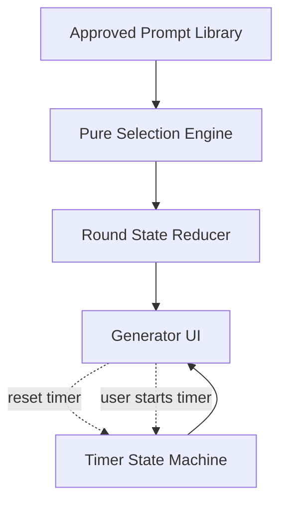

# From Random Picker to Round Engine: Designing a No-Repeat Game State Machine in React

Picking a random item is the easy part. The harder problem is preserving the rules across a sequence: generate a word, start and pause the timer, switch filters, generate again, and reload the page without creating an impossible round state.

A selection function can return a valid unseen ID and still be integrated into a UI that repeats a prompt, displays a word from the previous filter, or starts a countdown before the players are ready. The picker can be correct in isolation while the round is not.

A picker chooses an item. A round engine preserves the rules of the game across time.

The earlier guide, [Build a Filtered, No-Repeat Random Picker in TypeScript](https://github.com/zhengguge06-code/pictionary-word-generator/blob/main/docs/filtered-no-repeat-random-picker.md), covers that narrow selection boundary. This follow-up starts after a picker returns and asks how React should coordinate filters, session history, browser restoration, and a player-controlled timer.

## A correct picker is not yet a round engine

A picker answers one question: which eligible unseen prompt comes next? A round engine owns the temporal boundary around that answer: active filters, the displayed prompt, used-ID history, restoration after reload, and coordination with the timer.

Selection correctness is local. Round correctness is temporal. The second depends less on a clever random function than on explicit ownership and transitions.

## Separate the system into three state boundaries

A useful boundary is to split the feature into three cooperating subsystems.

### Selection state

The pure selection layer receives the reviewed catalog, active difficulty, active category, and used IDs. It returns only a matching unseen prompt. `All categories` broadens the category dimension but remains a filter value, not an eighth category. An unavailable pool never authorizes a fallback to another difficulty or category.

### Session state

The React round reducer holds the filters, current prompt, used IDs, and a restoration flag. Stable IDs make history independent of catalog ordering or later copy edits. Changing a filter can clear the displayed prompt without erasing the session's prior picks.

### Timer state

The timer is separate, with `idle`, `running`, `paused`, and `finished` phases. It owns the selected 60- or 90-second duration. While running, remaining time is derived from a wall-clock deadline; while idle, paused, or finished, it uses stored remaining time. Round state does not read or mutate these internals.



## Model user actions as explicit state transitions

React's reducer is useful here because queued round actions are processed against the latest reducer state. Timer actions remain in their own hook; the UI coordinates the two systems through explicit effects.

The following is a conceptual contract, not the production API:

```typescript
type RoundIntent =
  | { kind: 'generate'; sample: number }
  | { kind: 'filter-changed' }
  | { kind: 'history-reset' };

type RoundEffect = {
  prompt: 'select' | 'clear' | 'keep';
  history: 'append' | 'keep' | 'clear';
  timer: 'reset-idle' | 'keep';
};
```

### Generate the first word

The initial page shows "Ready to draw?" After the user chooses filters and requests a word, the reducer selects an eligible unseen prompt and appends its ID to history. The UI resets the timer to the selected duration, still `idle`. The player may need to hide or pass the screen, so generation and countdown start remain separate intentions.

### Generate the next word

"Next" is not a second algorithm. It uses the same selection path against a longer used-ID history, then resets the timer to `idle`. Only another explicit Start action begins the next countdown.

### Change difficulty or category

Changing difficulty or category clears the displayed prompt, preserves the session-wide history, and resets the timer to `idle`. Keeping history prevents a word from becoming eligible merely because the player temporarily explored another filter. Clearing the prompt prevents the UI from displaying a word that no longer matches the selected settings.

### Reset word history

"Reset word history" clears only used IDs. It does not change filters, generate a word, alter the timer phase, or change the selected duration. That explicit recovery control lets the player decide when repetition becomes acceptable instead of recycling the pool invisibly.

## Empty and exhausted are different product states

An unavailable generate action can have two causes. `empty` means the catalog has no prompt for the active filter; `exhausted` means matching prompts exist but the session has used all of them. The round layer preserves this distinction so the UI can offer an appropriate next action without weakening the filter.

| State | Meaning | Allowed response |
|---|---|---|
| Ready | Eligible unseen prompts available | Generate next word |
| Empty | No catalog prompts match the filter | Change filter or report data gap |
| Exhausted | Every matching prompt already shown this session | Reset history or change filter |

The engine exposes the pool state to the UI. The current interface visibly handles exhaustion; the contract does not imply that every state already has distinct production copy. Neither state permits a cross-filter fallback.

## Restore browser state without breaking hydration

Server rendering cannot read `sessionStorage`, so the server and first client render use a stable default: "Ready to draw?", `easy`, `all`, no current prompt, and an idle timer. A mount effect then restores the page session.

The restoration boundary is defensive but specific. Recognized difficulty values are checked, non-string used IDs are discarded, and a missing category falls back to `all`. Parsing or storage errors fall back to the default state. Because the controlled UI writes category values, this boundary does not claim a broader category allow-list guarantee.

Filters and used IDs are persisted; the displayed prompt and timer phase are not. Reloading the page in the same tab can restore the session history, but the player generates a fresh word and starts a fresh timer. This is tab-session memory, not `localStorage`, an account history, cross-device synchronization, or a promise of permanent non-repetition.

Persistence should restore the round, not redefine its rules.

## Treat the timer as a cooperating state machine

The timer lives outside the round reducer. Generate and filter-change handlers may call `reset()`, while Start, Pause, Resume, and duration selection belong to the timer itself. Neither subsystem reaches into the other's internal state.

The rule: the round engine may reset the timer, but only the player may start it.

While running, the timer computes remaining time from a wall-clock deadline and recomputes after visibility changes. An interval still requests UI updates, but callback count is not treated as elapsed time; after throttling, the next update derives the current value from the clock.

## Test event sequences, not only isolated functions

Pure-function tests cover filter matching, used-ID exclusion, unavailable states, and deterministic random boundaries. Reducer and browser checks then cover how those rules compose over time.

A representative browser sequence is:

1. The page loads and shows "Ready to draw?" with a full idle timer.
2. The user generates the first prompt.
3. The timer remains at the full duration and does not start.
4. The user starts the timer.
5. The user pauses, then generates the next prompt.
6. The next prompt differs from the previous one.
7. The timer returns to the selected full duration and waits in `idle`.
8. Used prompts become eligible again only after an explicit history reset.

Rapid clicks need a reducer-level check as well. Random samples can be created before dispatch, but selection must run when each queued action is reduced so it sees the latest used-ID history. Browser tests complement that check by exercising real controls and visible timer behavior; they are one integration layer, not the only possible testing strategy.

## Deliberate constraints keep the engine understandable

This engine deliberately omits accounts, a database, cross-device history, multiplayer rooms, automatic pool recycling, and automatic timer start. Permanent history would introduce expiry rules, catalog migrations, and synchronization conflicts. Automatic recycling would conceal exhaustion; automatic start would remove the preparation window.

These are scope decisions, not universal rules. A flashcard product may need durable history, while a competitive quiz may require an automatic countdown. For a casual browser game, a tab-scoped session and player-controlled pacing keep the contracts narrow enough for focused unit and interaction-sequence tests.

## Live case, previous guide, and source boundary

This lifecycle is used in the [Pictionary Word Generator](https://pictionarywordgenerator.io/), a free browser tool with 900+ reviewed prompts across three difficulties and seven categories. The previous guide covers the generic picker; this one covers the React round around it.

The production repository remains private. The code examples, type definitions, state tables, and diagrams in this guide are independently written to explain the public behavioral contracts. They do not reproduce the production application hooks, UI components, prompt library, or template code.

## Conclusion — The invariant lives across the whole round

A correct picker is necessary but not sufficient. The selection engine owns eligibility, the round reducer owns filters and history, the timer owns countdown state, and browser persistence restores only the session data it can support honestly.

The UI coordinates those boundaries through explicit transitions. The picker chooses the item. The reducer accumulates history. The timer measures time. The player decides when the countdown begins.

*Disclosure: I built the Pictionary Word Generator used as the live case study. The production repository remains private, and the examples in this guide are independently written to explain the public behavioral contracts.*

---

**Which state would you persist in a browser game—and which state would you deliberately reset?**
